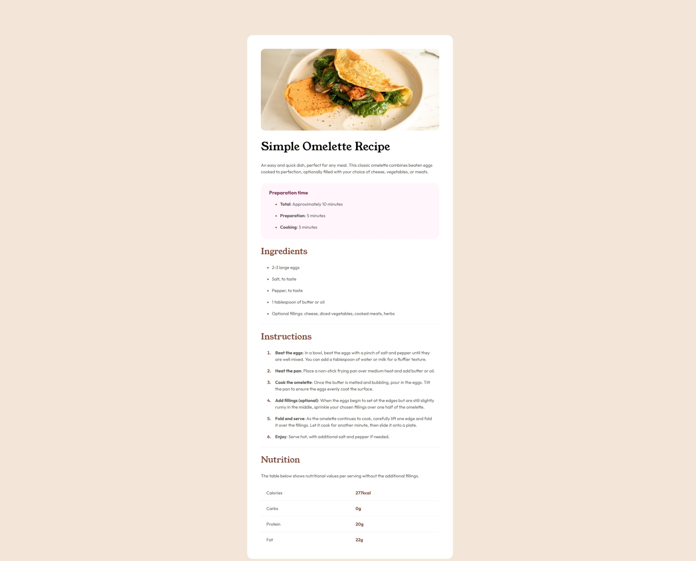

# Frontend Mentor - Recipe page solution

This is a solution to the [Recipe page challenge on Frontend Mentor](https://www.frontendmentor.io/challenges/recipe-page-KiTsR8QQKm). Frontend Mentor challenges help you improve your coding skills by building realistic projects. 

## Table of contents

- [Overview](#overview)
  - [The challenge](#the-challenge)
  - [Screenshot](#screenshot)
  - [Links](#links)
- [My process](#my-process)
  - [Built with](#built-with)
  - [What I learned](#what-i-learned)
  - [Useful resources](#useful-resources)
- [Author](#author)

## Overview

### Screenshot



### Links

- Live Site URL: [GitHub Pages](https://originalmistake.github.io/recipepage-repo/)

## My process

### Built with

- HTML
- CSS

### What I learned

```html
      <hr>
      <div class="nutrition">
          <p>Fat</p>
          <p id="num">22g</p>
      </div>
```
```css
ul, ol {
    display: flex;
    flex-direction: column;
    gap: 8px;
}
```

### Useful resources

- [W3Schools](https://www.w3schools.com/html/html_lists.asp) - This helped me differenciate between an ordered and unordered tag for the list.
- [W3Schools](https://www.w3schools.com/html/html_tables.asp) - Used to help with the layout of the nutrition table.
- [SheCodes](https://www.shecodes.io/athena/168627-how-to-change-the-color-of-an-hr-element-using-css#:~:text=in%201.88%20seconds-,To%20change%20the%20color%20of%20an%20) - Helped me add a section seperator/horizontal line.

## Author

- GitHub - [OriginalMistake](https://github.com/OriginalMistake)
- Frontend Mentor - [@OriginalMistake](https://www.frontendmentor.io/profile/OriginalMistake)